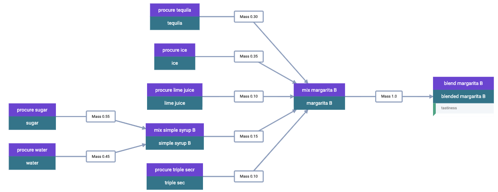
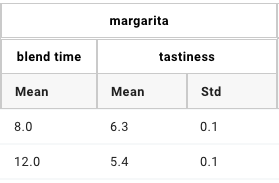
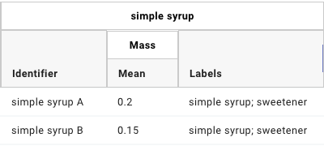
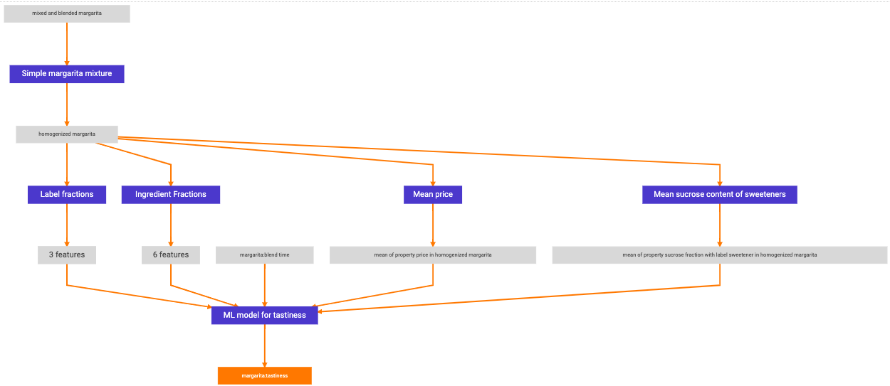

.. formulations_example:

Formulations Example
====================

The Citrine Platform is a powerful tool to analyze formulations data.
A formulation is, generally speaking, a mixture of mixtures.
Individual ingredients are mixed together to form more complex ingredients, which may themselves be mixed with other ingredients and/or mixtures, and so on.
Generally, the top-level formulation has some properties that we wish to optimize.
The ingredients themselves may also have known properties that are useful for understanding the properties of the top-level formulation.
In addition, each mixing process may be characterized by attributes such as the temperature of a reaction vessel or the speed of a mixing element.

The GEMD data model provides a way to record all of the information relevant to a formulations problem,
and Citrine's AI Engine turns this information into trained models that can predict the properties of novel formulations.
This section demonstrates how to express a complete formulations example in Citrine-python, from data ingestion to new candidate generation.

Example Raw Data
----------------

To demonstrate the formulations machinery, we consider a toy problem -- margaritas!
We scour our pantry and gather some materials, laid out in the table below.
These are known as "atomic" materials because for our purposes they are not broken into more fundamental materials.
Several materials have labels, which helps the Citrine Platform understand the relationships between materials.
We have also measured the sugar fraction for some of the materials, and we know the price per kilogram of each material.

.. note:: An ingredient (a material used in a process) can have different labels when used in different contexts.
    A label describes how a material is used or the role it plays, not the material itself.
    But to keep this example simple, we assume that a given ingredient always has all of the labels below whenever it is used.

.. list-table:: Atomic Materials Data
   :widths: 25 25 25 25
   :header-rows: 1

   * - Name
     - Label(s)
     - Sucrose Fraction
     - Price ($/kg)
   * - Sugar
     - Sweetener
     - 1.00 +/- 0.0
     - 2.30
   * - Water
     -
     - 0.00
     - 0.05
   * - Bottled Lime Juice
     - Acid
     - 0.03 +/- 0.01
     - 14.00
   * - Triple Sec
     - Sweetener, Alcohol
     - 0.36 +/- 0.04
     - 18.99
   * - Tequila
     - Alcohol
     -
     - 29.00
   * - Ice
     -
     -
     - 2.75

We begin by creating two types of simple syrup--a mixture of sugar and water.
The quantities are in units of mass fraction.

.. list-table:: Simple Syrup Data
   :widths: 25 25 25 25
   :header-rows: 1

   * - Name
     - Label(s)
     - Water Quantity
     - Sugar Quantity
   * - Simple Syrup A
     - Simple Syrup, Sweetener
     - 0.50
     - 0.50
   * - Simple Syrup B
     - Simple Syrup, Sweetener
     - 0.45
     - 0.55

We now create margaritas by mixing together a subset of ingredients and blending for some time.
The atomic materials are labeled as described in the "Materials Data" table, and the simple syrups are given a "simple syrup" label.
In addition to the ingredient mass fractions, we record the blending time, in seconds.
The margaritas are judged on an ultra-rigorous "tastiness" scale, which ranges from 0.0 to 10.0
The table below shows two examples.

.. list-table:: Margarita Data
   :widths: 35 25 40 35 35 35 35 25 25 25
   :header-rows: 1

   * - Name
     - Tastiness
     - Blend Time (s)
     - Simple Syrup A Quantity
     - Simple Syrup B Quantity
     - Sugar Quantity
     - Bottled Lime Juice Quantity
     - Triple Sec Quantity
     - Tequila Quantity
     - Ice Quantity
   * - Margarita A
     - 6.3 +/- 0.1
     - 8.0
     - 0.20
     - 0.0
     - 0.0
     - 0.15
     - 0.0
     - 0.25
     - 0.40
   * - Margarita B
     - 5.4 +/- 0.1
     - 12.0
     - 0.0
     - 0.15
     - 0.0
     - 0.10
     - 0.10
     - 0.30
     - 0.35

Ingesting Data
--------------

.. Warning:: Ingesting data to GEMD is most easily done with additional tooling to reduce the amount of required programming.

Although we will not describe every step of the data ingestion process, we will highlight several data objects and their inter-connections.
Perhaps most crucial are the `attribute templates`, which correspond to the parameters of the blending process and the properties of the materials/formulations.
The name, bounds, and units on these templates will later be matched to descriptors in the AI Engine.
Make sure to set the bounds wide enough to encompass all anticipated use cases of the templates.

.. Attention:: At this time, currency units are not supported by default because of issues around fluctuating conversion rates.
    For the "price" template, we therefore use units of 1/kg instead of $/kg.

.. note:: In the code examples that follow, imports are assumed to be cumulative.
    Once an import has been demonstrated, we do not include it in subsequent code blocks.

.. code-block:: python

    from citrine.resources.parameter_template import ParameterTemplate
    from citrine.resources.property_template import PropertyTemplate
    from gemd.entity.bounds import RealBounds

    # Assume we have already created a project and dataset, named "project" and "dataset."
    # We give the templates ids with a custom scope so that they can be easily retrieved.
    blend_time_template = dataset.parameter_templates.register(
        ParameterTemplate(
            "blend time",
            bounds=RealBounds(0, 60.0, "s"),
            uids={"margaritas-id": "blend time template"}
        )
    )
    price_template = dataset.property_templates.register(
        PropertyTemplate(
            "price",
            bounds=RealBounds(0, 100, "1/kg"),
            uids={"margaritas-id": "price template"}
        )
    )
    sucrose_fraction_template = dataset.property_templates.register(
        PropertyTemplate(
            "sucrose fraction",
            bounds=RealBounds(0, 1, ""),
            uids={"margaritas-id": "sucrose fraction template"}
        )
    )
    tastiness_template = dataset.property_templates.register(
        PropertyTemplate(
            "tastiness",
            bounds=RealBounds(0, 10, ""),
            uids={"margaritas-id": "tastiness property template"}
        )
    )

The attribute templates are attached to relevant object templates.
For example, the process template to represent blending should include ``blend_time_template`` as a ``parameter``.

Although it contains no attributes, we should particular pay attention to the templates that represent the mixing processes.
These will be used to convert GEMD data into formulations.
It is possible to use different process templates to distinguish between different types of mixing, but here we use the one template to represesnt both types of mixing that occur (mixing the simple syrup and mixing the margarita ingredients).
The template includes a comprehensive list of all allowed names and labels.

.. code-block:: python

    from citrine.resources.process_template import ProcessTemplate

    mix_template = dataset.process_templates.register(
        ProcessTemplate(
            "mix",
            uids={"margaritas-id": "mix template"},
            allowed_names=["simple syrup", "sugar", "water", "lime juice", "orange liqueur", "tequila", "ice"],
            allowed_labels=["sweetener", "acid", "alcohol", "simple syrup"]
        )
    )

.. Hint:: Here we must distinguish between "name" and "identifier".
    "Name" in this case is an abstract way of describing the types of things that go into a process.
    "Identifier" is the unique way of referring to one particular material.
    In this example the template allows the name "lime juice," but does not specify the specific material.
    For simplicity, this example only includes one type of lime juice, "bottled lime juice," but we might also have "fresh-squeezed lime juice" or several batches of bottled lime juice, each with their own unique identifier.
    In some cases, such as "ice," for which we know that only one material will be used, we have conflated the name and identifier.

    Specifying ``allowed_names`` is not required for GEMD, but will make it easier to build the eventual table.
    In this case, the table will have a super-column describing the use of lime juice in the margarita, with sub-columns for the identifier of the specific lime juice used, its quantity, and any labels belonging to the ingredient.

    If a suitable set of names are not known, it is possible to be generic: "mixing input 1," "mixing input 2," etc.

To fill out the example, we illustrate some of the objects involved in specifying the spec for a particular margarita recipe.
This assumes that the material specs for the atomic materials and the simple syrups have already been uploaded.

.. Attention:: It is important to assign human-readable uids to the Material Runs, as these will be the unique identifiers in the resulting table.

.. code-block:: python

    from citrine.resources.process_spec import ProcessSpec
    from citrine.resources.ingredient_spec import IngredientSpec
    from citrine.resources.material_spec import MaterialSpec
    from gemd.entity.value import NominalReal
    from gemd.entity.link_by_uid import LinkByUID

    mix_margarita_spec = dataset.process_specs.register(
        ProcessSpec("mix margarita B", template=LinkByUID("margaritas-id", "mix template"))
    )
    dataset.ingredient_specs.register(
        IngredientSpec(
            "simple syrup",
            material=simple_syrup_B_spec,  # assume that this and the other relevant specs exist in memory
            process=mix_margarita_spec,
            labels=["simple syrup"],
            mass_fraction=NominalReal(nominal=0.15, units="")
        )
    )
    dataset.ingredient_specs.register(
        IngredientSpec(
            "triple sec",
            material=triple_sec_spec,
            process=mix_margarita_spec,
            labels=["alcohol", "sweetener"],
            mass_fraction=NominalReal(nominal=0.1, units="")
        )
    )
    # register remaining ingredient specs....
    # Then register the resulting material spec.
    margarita_spec = dataset.material_specs.register(
        MaterialSpec(
            "margarita B",
            process=mix_margarita_spec,
            template=LinkByUID("margaritas-id", "margarita template")
        )
    )

This material spec is then fed as the sole ingredient into a "blend margarita B" process spec, which produces a "blended margarita B" material spec.
A measurement spec is attached to the material spec to measure "tastiness."
Finally, run objects are created corresponding to each spec, to represent what actually happened.
Whew!
That's a lot, which is why this is best done with additional tooling, whether in code or in the GUI.

A rendering of this example material history is shown below.

    Material History for Blended Margarita B

Repeating this process once for each margarita sample, we can build up a rich dataset for machine learning.

Building a Table
----------------

We now build a GEM Table to represent the margaritas' material histories in tabular format.
This table will be used as training data when building a machine learning graphical model.
For more detailed information on GEM Tables, see the section on :doc:`data extraction <data_extraction>`.

In order to make a GEM Table, we start with a Table Configuration object.
In this example we will build up the configuration in small steps.
As we will see, templates are crucial to configuring the table.

The code below defines the rows and defines one column that contains the identifier of each row.

.. code-block:: python

    from citrine.resources.table_config import TableConfig
    from citrine.gemtables.rows import MaterialRunByTemplate
    from citrine.gemtables.variables import TerminalMaterialIdentifier
    from citrine.gemtables.columns import IdentityColumn

    material_templates_to_include = [
        blended_margarita_template, simple_syrup_template, base_material_template
    ]
    scope = "margaritas-id"

    config = TableConfig(
        name="margarita formulations table",
        description="",
        datasets=[dataset.uid],
        rows=[
            MaterialRunByTemplate(
                templates=[LinkByUID.from_entity(t, scope) for t in material_templates_to_include]
            )
        ],
        variables=[TerminalMaterialIdentifier(name="name", headers=["name"], scope=scope)],
        columns=[IdentityColumn(data_source="name")]
    )

Let's step through the pieces of this code.
We gave the configuration a name and description for human-readability.
We defined the datasets that contain the material histories; for the purposes of this example we assume everything is in the dataset ``dataset``.
We then defined the rows as being based on all materials that link to one of a set of Material Templates.
For the purposes of this example, assume that we have defined separate material templates for the base materials, the simple syrups, the margaritas, and the blended margaritas.
Notice that we do _not_ include the material template for the unblended margaritas.
For the purposes of machine learning, we want to compress the mixing and blending into a single training row.

We define a single variable/column that contains a unique identifier for each row.
Every object on the Citrine Platform has a unique id with scope ``id``, but these are difficult for a human to read.
In this example we assume that we have given the materials human-readable uniquely identifying names with scope "margaritas-id."
These names will appear in the first column of the table.

We now use the :func:`~citrine.resources.table_config.TableConfig.add_columns` method to expand the configuration.
We first use the :class:`~citrine.gemtables.variables.AttributeByTemplate` variable to record the attributes.
For those attributes that may have non-zero uncertainty, we include columns for both mean and standard deviation.

.. code-block:: python

    from citrine.gemtables.variables import AttributeByTemplate
    from citrine.gemtables.columns import MeanColumn, StdDevColumn

    scope = "margaritas-id"
    config = config.add_columns(
        variable=AttributeByTemplate(
            name="price",
            headers=["price"],
            template=LinkByUID(scope, "price template")
        ),
        columns=[MeanColumn(data_source="price")]
    )
    config = config.add_columns(
        variable=AttributeByTemplate(
            name="sucrose fraction",
            headers=["sucrose fraction"],
            template=LinkByUID(scope, "sucrose fraction template")
        ),
        columns=[MeanColumn(data_source="sucrose fraction"), StdDevColumn(data_source="sucrose fraction")]
    )
    config = config.add_columns(
        variable=AttributeByTemplate(
            name="blend time",
            headers=["margarita", "blend time"],
            template=LinkByUID(scope, "blend time template")
        ),
        columns=[MeanColumn(data_source="blend time")]
    )
    config = config.add_columns(
        variable=AttributeByTemplate(
            name="tastiness",
            headers=["margarita", "tastiness"],
            template=LinkByUID(scope, "tastiness property template")
        ),
        columns=[MeanColumn(data_source="tastiness"), StdDevColumn(data_source="tastiness")]
    )

The ``name`` is only used to link a variable to columns.
The ``headers`` are used to structure the table *and also create the names of the eventual descriptors*.
The figure below shows how some of the columns may be rendered in a GEM Table.
Because they both have the "margarita" heading, "blend time" and "tastiness" are grouped together.

    GEM Table "margarita properties" columns

We now add a set of three variables for each mixing ingredient: one for the identifier, one for the quantity, and one for the labels.
The code block below shows how we would add a set of columns for "simple syrup."
This must be repeated once for each ingredient.

.. code-block:: python

    from citrine.gemtables.variables import (
        IngredientIdentifierInOutput,
        IngredientQuantityInOutput,
        IngredientLabelsSetInOutput,
        IngredientQuantityDimension
    )
    from citrine.gemtables.columns import ConcatColumn

    ing_name = "simple syrup"
    mix_template_link = LinkByUID.from_entity(mix_template, scope)
    identity_var = IngredientIdentifierInOutput(
        name=f"{ing_name} identifier",
        headers=[ing_name, "Identifier"],
        ingredient_name=ing_name,
        process_templates=[mix_template_link],
        scope=scope
    )
    quantity_var = IngredientQuantityInOutput(
        name=f"{ing_name} mass",
        headers=[ing_name, "Mass"],
        process_templates=[mix_template_link],
        ingredient_name=ing_name,
        quantity_dimension=IngredientQuantityDimension.MASS,
    )
    labels_var = IngredientLabelsSetInOutput(
        name=f"{ing_name} labels",
        headers=[ing_name, "Labels"],
        process_templates=[mix_template_link],
        ingredient_name=ing_name
    )
    config = config.add_columns(
        variable=identity_var, columns=[IdentityColumn(data_source=identity_var.name)]
    )
    config = config.add_columns(
        variable=quantity_var, columns=[MeanColumn(data_source=quantity_var.name)],
    )
    config = config.add_columns(
        variable=labels_var,
        columns=[
            ConcatColumn(
                data_source=labels_var.name,
                subcolumn=IdentityColumn(data_source=labels_var.name)
            )
        ]
    )

The figure below shows how these three columns may be rendered in a GEM Table.

    GEM Table "simple syrup ingredient" columns

Lastly, we register the configuration and build the table.
Note that this can be a long-running process depending on how many cells are in the table.
To build the table asynchronously, use :func:`~citrine.resources.gemtables.GemTableCollection.initiate_build`.

.. code-block:: python

    config = project.table_configs.register(config)
    table = project.tables.build_from_config(config)

Training a Predictor
--------------------

With the GEM Table in hand, we build and train a predictor to predict the tastiness of novel margarita recipes.
The first step is to define a :class:`~citrine.informatics.data_sources.GemTableDataSource` based on the GEM Table, ``table``.
We choose to define a :class:`~citrine.informatics.descriptors.FormulationDescriptor` to hold the formulation;
if we do not specify it then a default descriptor will be generated, but given how crucial this descriptor is it is best to specify it directly.

.. code-block:: python

    from citrine.informatics.descriptors import FormulationDescriptor
    from citrine.informatics.data_sources import GemTableDataSource

    formulation = FormulationDescriptor("mixed and blended margarita")
    data_source = GemTableDataSource(
        table_id=table.uid,
        table_version=table.version,
        formulation_descriptor=formulation
    )

The first component of the graphical model is a :class:`~citrine.informatics.predictors.simple_mixture_predictor.SimpleMixturePredictor`, which flattens the input formulation--it repeatedly replaces components with their ingredients until only the atomic ingredients remain.
This flattening efficiently teaches the predictor about the relationship between materials.
In this case, it learns exactly how "simple syrup A" and "simple syrup B" are similar to each other because they both contain atomic materials sugar and water but in slightly different amounts.
Although the homogeneous representation is not entirely appropriate for all formulations problems, it is usually an excellent approximation,
especially when coupled with flexible machine learning models that can emulate more complex relationships within the data.

.. code-block:: python

    from citrine.informatics.predictors import SimpleMixturePredictor

    flat_formulation = FormulationDescriptor("homogenized margarita")
    simple_mixture_predictor = SimpleMixturePredictor(
        name="Simple margarita mixture",
        description="Flatten a mixture of mixtures into leaf ingredients",
        input_descriptor=formulation,  # this is the formulation descriptor from the table
        output_descriptor=flat_formulation  # this is a new descriptor to represent the flattened formulation
    )

Using the flattened formulation as an input, we create several "featurizers" to compute features; these will be the inputs to the machine learning model(s).
The featurizer predictors are :class:`~citrine.informatics.predictors.ingredient_fractions_predictor.IngredientFractionsPredictor`,
:class:`~citrine.informatics.predictors.label_fractions_predictor.LabelFractionsPredictor`, and :class:`~citrine.informatics.predictors.mean_property_predictor.MeanPropertyPredictor`.
We create one predictor each for ingredient and label fractions, and two mean property predictors--
one that computes the mean price over all ingredients (this will be used to constraint the price of new margarita recipes) and one that computes the mean sucrose content of just the sweeteners.

.. code-block:: python

    from citrine.informatics.descriptors import RealDescriptor
    from citrine.informatics.predictors import LabelFractionsPredictor, IngredientFractionsPredictor, MeanPropertyPredictor

    label_fractions_predictor = LabelFractionsPredictor(
        name="Label fractions",
        description="Total quantity that is from one of the component types",
        input_descriptor=flat_formulation,
        labels={"acid", "alcohol", "sweetener"},
    )

    ingredient_fractions_predictor = IngredientFractionsPredictor(
        name="Ingredient Fractions",
        description="Compute the fraction of each ingredient",
        input_descriptor=flat_formulation,
        # Note that these are the identifiers of the atomic ingredients, not the names.
        # (the specific material identifier "bottled lime juice" instead of the generic ingredient name "lime juice")
        ingredients={"bottled lime juice", "water", "ice", "sugar", "tequila", "triple sec"},
    )

    # These descriptors must match up with the Variable in the GEM Table and the associated Attribute Template
    price = RealDescriptor("price", lower_bound=0, upper_bound=100, units="1/kg")
    sucrose_fraction = RealDescriptor("sucrose fraction", lower_bound=0, upper_bound=1, units="")
    mean_price_predictor = MeanPropertyPredictor(
        name="Mean price",
        description="Compute weighted mean of price per kilogram",
        input_descriptor=flat_formulation,
        properties=[price],
        impute_properties=False,
        p=1
    )
    mean_sweetness_predictor = MeanPropertyPredictor(
        name="Mean sucrose content of sweeteners",
        description="Compute weighted mean of sucrose content for sweeteners",
        input_descriptor=flat_formulation,
        properties=[sucrose_fraction],
        impute_properties=False,
        label="sweetener",
        p=1
    )

This provides an illustration of how we can use a graphical model to inject domain knowledge.
We know that the balance of sweetness and acidity is crucial to taste.
By computing the fraction of the margarita that is acidic, the fraction that is a sweetener, and the average sucrose content of those sweeteners,
we provide the machine learning model with crucial variables that it can use to discover patterns *without* requiring large amounts of training data.
Furthermore, we can introduce new acids and sweeteners into our pantry and the model will be able to make reasonable predictions even if it has not been trained on them.

The final piece is an :class:`~citrine.informatics.predictors.auto_ml_predictor.AutoMLPredictor` for ``tastiness``.
We use the :func:`~citrine.resources.descriptors.DescriptorMethods.from_predictor_responses` method to get the outputs of the featurizers.
We also use ``blend time`` as an input.

.. code-block:: python

    from citrine.informatics.predictors import AutoMLPredictor

    label_fractions_descriptors = project.descriptors.from_predictor_responses(
        predictor=label_fractions_predictor, inputs=[flat_formulation],
    )
    ingredient_fractions_descriptors = project.descriptors.from_predictor_responses(
        predictor=ingredient_fractions_predictor, inputs=[flat_formulation],
    )
    price_descriptors = project.descriptors.from_predictor_responses(
        predictor=mean_price_predictor, inputs=[flat_formulation],
    )
    sweetness_descriptors = project.descriptors.from_predictor_responses(
        predictor=mean_sweetness_predictor, inputs=[flat_formulation]
    )

    blend_time = RealDescriptor("margarita~blend time", lower_bound=0, upper_bound=60, units="s")
    tastiness = RealDescriptor("margarita~tastiness", lower_bound=0, upper_bound=10, units="")

    ml_inputs = (
        ingredient_fractions_descriptors
        + label_fractions_descriptors
        + price_descriptors
        + sweetness_descriptors
        + [blend_time]
    )
    ml_model = AutoMLPredictor(
        name="ML model for tastiness",
        description="",
        output=tastiness,
        inputs=ml_inputs
    )

Where did the descriptor keys ``margarita~blend time`` and ``margarita~tastiness`` come from?
They came from concatenating the headers in the variables in the table, and the bounds and units came from the attribute templates.
It's a lot to keep track of, which is why there is the :func:`~citrine.resources.descriptors.DescriptorMethods.descriptors_from_data_source` method.
Calling ``project.descriptors.descriptors_from_data_source(data_source)`` returns a list of all of the descriptors emitted by the data source.
Make sure that these are the descriptors you are using as inputs to your predictor.

Lastly, we wrap everything in a :class:`~citrine.informatics.predictors.graph_predictor.GraphPredictor` and register it.

.. code-block:: python

    from citrine.informatics.predictors import GraphPredictor

    predictors_list = [
        simple_mixture_predictor,
        ingredient_fractions_predictor,
        label_fractions_predictor,
        mean_price_predictor,
        mean_sweetness_predictor,
        ml_model
    ]

    graph_predictor = GraphPredictor(
        name="Graphical model for tastiness of blended margaritas",
        description="",
        predictors=predictors_list,
        training_data=[data_source] # the data source we defined above
    )
    graph_predictor = project.predictors.register(graph_predictor)

One representation of this graphical model is shown below.

    Graphical model to predict tastiness of a margarita

Defining a Design Space
-----------------------

Now that we have a trained predictor, the next step to finding the *world's best margarita* is to define the search space.
A :class:`~citrine.informatics.design_spaces.formulation_design_space.FormulationDesignSpace` defines the ingredients, the labels, and any constraints.
In addition to the labels used in the predictor, we also create a label for "simple syrup A" and "simple syrup B."
This allows us to specify that one and only one of the simple syrups should be used.

Notice that the design space's formulation descriptor corresponds to the original, unflattened formulation.
That's because we want to describe the margarita we are physically making in our kitchen.
The predictor takes care of flattening it to its atomic ingredients.

.. code-block:: python

    from citrine.informatics.design_spaces import FormulationDesignSpace
    from citrine.informatics.constraints import IngredientCountConstraint, IngredientFractionConstraint

    fds = FormulationDesignSpace(
        name="margaritas formulation",
        description="",
        formulation_descriptor=formulation,
        ingredients={"simple syrup A", "simple syrup B", "tequila", "ice", "triple sec", "bottled lime juice"},
        labels={
            "acid": {"bottled lime juice"},
            "alcohol": {"tequila", "triple sec"},
            "sweetener": {"triple sec"},
            "simple syrup": {"simple syrup A", "simple syrup B"}
        },
        constraints={
            IngredientCountConstraint(formulation_descriptor=formulation, min=3, max=5),
            IngredientCountConstraint(formulation_descriptor=formulation, min=1, max=1, label="simple syrup"),
            IngredientFractionConstraint(formulation_descriptor=formulation, ingredient="bottled lime juice", min=0.15, max=0.30)
        }
    )

But that's not all; we also have to define the ``blend time`` input.
We do this by wrapping a :class:`~citrine.informatics.design_spaces.product_design_space.ProductDesignSpace` around the formulation design space and a ``blend time`` dimension.

.. code-block:: python

    from citrine.informatics.design_spaces import ProductDesignSpace
    from citrine.informatics.dimensions import ContinuousDimension

    design_space = ProductDesignSpace(
        name="margaritas design space",
        description="",
        subspaces=[fds],
        dimensions=[ContinuousDimension(descriptor=blend_time, lower_bound=5.0, upper_bound=20.0)]
    )
    design_space = project.design_spaces.register(design_space)

Proposing New Formulation Candidates
------------------------------------

With the pieces assembled, we define a :class:`~citrine.informatics.workflows.design_workflow.DesignWorkflow`.
Our goal is to find the margarita that is most likely to have a tastiness score above 7.5, while keeping the cost per kg below $12.50.
We define an :class:`~citrine.informatics.scores.LIScore` with this objective and constraint, define a design workflow with the predictor and design space, and trigger the design workflow on the score.

.. code-block:: python

    from citrine.informatics.scores import LIScore
    from citrine.informatics.objectives import ScalarMaxObjective
    from citrine.informatics.constraints import ScalarRangeConstraint
    from citrine.informatics.workflows.design_workflow import DesignWorkflow

    score = LIScore(
        objectives=[ScalarMaxObjective(descriptor_key=blend_time.key)],
        baselines=[7.5],
        constraints=[ScalarRangeConstraint(
            descriptor_key=price_descriptors[0].key, upper_bound=12.50, lower_bound=0.00
        )]
    )

    design_workflow = DesignWorkflow(
        name="best margarita",
        design_space_id=design_space.uid,
        predictor_id=graph_predictor.uid,
        processor_id=None  # we use the default continuous search processor
    )
    design_workflow = project.design_workflows.register(design_workflow)

    execution = design_workflow.design_executions.trigger(score)

Once the execution is complete, ``execution.candidates()`` returns a paginated list of results.
How good is the margarita?
Well, that depends on the training data.
