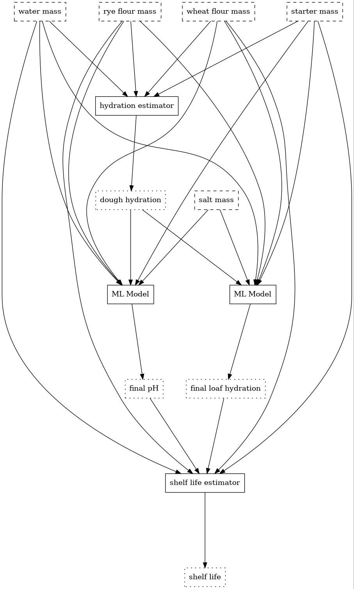

AI Engine Code Examples
=======================

.. _graph_predictor_example:

Example: preprocessing and postprocessing in a GraphPredictor
-------------------------------------------------------------

Within a :class:`~citrine.informatics.predictors.graph_predictor.GraphPredictor`, one can use :class:`~citrine.informatics.predictors.expression_predictor.ExpressionPredictor` modules to preprocess data before performing machine learning with a :class:`~citrine.informatics.predictors.simple_ml_predictor.SimpleMLPredictor`, and to post-process the SimpleMLPredictor's output.
This is a very common and powerful use case for graphical modeling.
Here we show an example of how to combine these modules to accomplish those many suitable tasks.

Using ExpressionPredictors to perform pre-processing can be used to featurize data, which is a valuable way to leverage domain knowledge by transforming raw inputs into quantities known to be relevant.
In the example below, we use an ExpressionPredictor to annotate the training data with a "hydration ratio".
The hydration ratio is the mass ratio of water to flour.
Bakers know this quantity to be of fundamental importance to the taste and texture of bread, so computing this quantity might be expected to help the SimpleMLPredictor make more efficient use of scarce training data.
(In a more standard materials science context, an ExpressionPredictor might be used to annotate semiconductor data with an analytical expression of idealized electron mobility as a function of dopant concentrations.)

In the example below, we use the ExpressionPredictor feature to compute a bread loaf product's shelf life as a figure of merit.
This simulates a scenario where shelf life is determined by a deterministic quality control rule that depends on a few physically measurable quantities: ``final pH`` and ``final hydration`` as estimated by the SimpleMLPredictor, as well as the fraction of salt in the ingredients.
Using ExpressionPredictors in this manner to post-process learned data is often useful for displaying information on the platform based on transformations of the learned physical properties.
This pattern is also extremely useful for performing optimization over complex objectives: in the following example, we can use shelf life as an objective or constraint in a :doc:`DesignWorkflow <design_workflows>`.

.. code:: python

    from citrine.informatics.descriptors import RealDescriptor
    from citrine.informatics.predictors import (
        ExpressionPredictor,
        GraphPredictor,
        SimpleMLPredictor
    )

    ######## Omitted step: create DataSource with columns associated with the following descriptors ########
    # wheat_flour_quantity = RealDescriptor(
    #     'wheat flour mass', lower_bound=300, upper_bound=550, units="g")
    # rye_flour_quantity = RealDescriptor(
    #     'rye flour mass', lower_bound=0, upper_bound=100, units="g")
    # water_quantity = RealDescriptor(
    #    'water mass', lower_bound=200, upper_bound=400, units="g")
    # salt_quantity = RealDescriptor(
    #    'salt mass', lower_bound=4, upper_bound=8, units="g")
    # starter_quantity = RealDescriptor(
    #    'starter mass', lower_bound=5, upper_bound=30, units="g")
    # final_ph = RealDescriptor(
    #    'final pH', lower_bound=2.5, upper_bound=5, units="")
    # final_loaf_hydration = RealDescriptor(
    #    'final loaf hydration', lower_bound=0, upper_bound=100, units="")
    #
    # data_source = create_ara_data_source_from_breads_gemd(
    #    descriptors=[...descriptors above...])

    dough_hydration = RealDescriptor(
        'dough hydration', lower_bound=0, upper_bound=1)
    shelf_life = RealDescriptor(
        'approximate shelf life', lower_bound=0, upper_bound=72)

    dough_hydration_calculator = ExpressionPredictor(
        name = 'dough hydration calculator',
        expression = '(water + 0.5*starter) / (wheat + rye + 0.5*starter)',
        output = dough_hydration,
        aliases = {
            'wheat': wheat_flour_quantity,
            'rye': rye_flour_quantity,
            'water': water_quantity,
            'starter': starter_quantity
        }
    )

    physical_properties_predictor = SimpleMLModel(
        name = 'physical properties model',
        inputs = [
            wheat_flour_quantity,
            rye_flour_quantity,
            water_quantity,
            salt_quantity,
            starter_quantity,
            dough_hydration
        ],
        outputs = [
            final_ph,
            final_loaf_hydration,
        ],
        training_data=[training_table]
    )

    shelf_life_calculator = ExpressionPredictor(
        name = 'shelf life estimator',
        expression = '4*exp(-0.1*pH - 1.3*w^2 + 5*(water+0.5*starter)/(wheat+rye+water+starter))',
        output = shelf_life,
        aliases = {
            'pH': final_ph,
            'w': final_loaf_hydration,
            'wheat': wheat_flour_quantity,
            'rye': rye_flour_quantity,
            'water': water_quantity,
            'starter': starter_quantity
        }
    )

    graph_predictor = GraphPredictor(
        name = 'bread shelf life predictor',
        description = 'Uses bread ingredients to estimate shelf life, given a fixed manufacturing process',
        predictors = [
            dough_hydration_calculator,
            physical_properties_predictor,
            shelf_life_calculator
        ]
    )

This example is visualized below.
Nodes with dashed outlines represent degrees of freedom in the recipe, and those with solid outlines represent predictors.
Nodes with dotted outlines represent predicted quantities; note that only ``final pH`` and ``final loaf hydration`` are the only predicted quantities that exist in the training data.

|Bread Predictor Graph Visualization|
